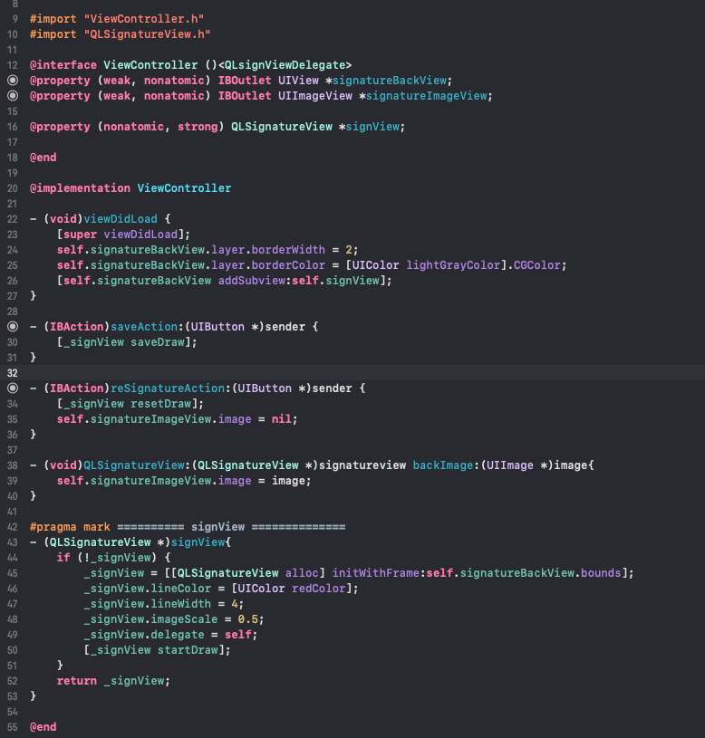

# QLSignature
iOS 手写签名
### 使用场景
用于电子版文件协议在手机上手写签名

### 使用方法




可设置属性

```
/// 线宽 默认1
@property (nonatomic, assign) CGFloat lineWidth;
/// 线颜色 默认黑
@property (nonatomic, strong) UIColor *lineColor;
/// 生成图片的缩放比例 默认1不缩放 范围0.1~1.0
@property (nonatomic, assign) CGFloat imageScale;
```